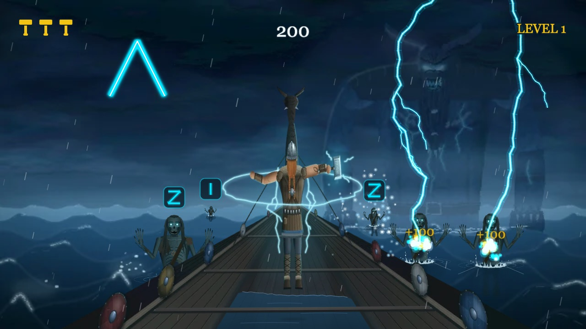

# Stormrune

Defend a Viking longship from the draugar by drawing Norse runes.



## Overview

Stormrune is a 2D browser game made with [Phaser 4](https://phaser.io/). Thor
stands on the deck of a longship while undead warriors, the draugar, rise from a
stormy sea and wade toward it. Each one carries a queue of runes above its head.
Draw the matching rune with your mouse or finger and Thor calls down lightning,
removing that rune. When a draugr's queue
is empty it is destroyed. If a draugr reaches the ship you lose one of your three
lives, and losing all three ends the game.

The game runs in any modern browser, on desktop and on phones in landscape.

## How to play

Draw a rune anywhere on the screen in one stroke:

| Rune   | Shape | How to draw it                       |
| ------ | :---: | ------------------------------------ |
| Isa    |   │   | one straight line, top to bottom     |
| Sowilo |   Z   | right, diagonal down-left, right     |
| Tiwaz  |   ^   | up-right, then down-right            |

- The **bright** rune in a draugr's panel is the one that hurts it next. The dimmed ones come after.
- One rune strikes **every** draugr whose next rune matches, so a single stroke can hit several at once.
- Each rune has its own attack: Isa makes Thor raise his hammer, Sowilo calls a storm around him, and Tiwaz is a leaping spin.
- Size, position and direction don't matter. A Tiwaz drawn right-to-left still counts.
- A stroke that isn't a rune just fizzles. Misreads never cost you a life.
- Destroy enough draugar to clear a level. Each level spawns them more often, makes them walk faster and gives them longer rune queues. After level 5 the game is endless, getting about 10% harder per level.
- Landscape only: on a phone held upright, the game pauses and asks you to rotate.

## Running it locally

You need [Node.js](https://nodejs.org/) 20.19+ or 22.12+ (the minimum for Vite 8).

```bash
npm install
npm run dev
```

Then open the address Vite prints (usually http://localhost:5173).

| Command                    | What it does                                                 |
| -------------------------- | ------------------------------------------------------------ |
| `npm run dev`              | Development server with hot reload                           |
| `npm run build`            | Production build into `dist/`                                |
| `npm run preview`          | Serves the production build from `dist/`                     |
| `npm run check:recognizer` | Accuracy test for the rune recognizer (runs in Node, no browser) |
| `npm run export:sprites`   | Rebuilds all the sprite sheets (sea, longship, Thor, draugar) from the designs in `art/designs` (needs Google Chrome and an internet connection) |

### Play on your phone

1. Connect the phone and the computer to the same Wi-Fi network.
2. Run `npm run build` and then `npm run preview -- --host`. You can also use `npm run dev -- --host`.
3. Open the **Network** address Vite prints on the phone and hold it in landscape.

### Debug mode

Add `?debug` to the URL, for example `http://localhost:5173/?debug`, to show what the
recognizer read for each stroke and its score. It also exposes a read-only
`window.__stormrune.state` snapshot for automated browser tests. Players never see it.

## Purpose

This project was built for the Game Framework module of BYU-Idaho's CSE 310. It had two goals:

- **Learn a real game framework.** Phaser 4 covers scenes, pointer and touch input,
  Graphics drawing, tweens, timers, particles and the new filter system (used for the
  glowing rune trail). It also supports responsive scaling for phones.
- **Implement a published algorithm instead of pulling in a library.** Stroke
  recognition is our own implementation of the $1 Unistroke Recognizer
  ([src/systems/RuneRecognizer.js](src/systems/RuneRecognizer.js)).

All art and characters are original:

- **The stormy sea (with a giant in the mist), the longship, Thor and the draugar** are
  detailed vector designs made for this project ([art/designs](art/designs)).
  `npm run export:sprites` renders their animation frames into the WebP sprite sheets in
  [public/assets/sprites](public/assets/sprites).
- **Lightning, rain, sparks, runes, the stroke trail and the HUD** are drawn with code at runtime.

## Development environment

- **Phaser 4.2.1**: 2D game framework. Uses the WebGL renderer, with Canvas as a fallback.
- **Vite 8**: development server and production bundler.
- **JavaScript (ES modules)**: no TypeScript, and no runtime dependency other than Phaser.
- **Node.js and npm**: run the tooling.
- **Visual Studio Code**: editor.
- **Chrome DevTools**: device emulation for phone screens and orientation.

## How it works

```
src/
  main.js                    Phaser config: 1280x720 scaled with FIT, scene list
  scenes/BootScene.js        loads the sprite sheets, registers the animations
  scenes/GameScene.js        orchestrates gameplay: levels, casting, damage
  scenes/GameOverScene.js    final score and restart
  systems/StrokeInput.js     pointer capture and the glowing trail
  systems/RuneRecognizer.js  $1 Unistroke Recognizer
  systems/runeTemplates.js   the three rune shapes
  systems/Lightning.js       procedural lightning bolts
  systems/spriteSheets.js    loads sheets; joins animations split over several sheets
  entities/Draugr.js         enemy: wading walk, rune queue, death by lightning
  entities/Longship.js       the boat, in layers; rocks, carrying Thor with it
  entities/ShipWater.js      breaking waves, the pool on deck, splashes against the hull
  entities/Thor.js           the hero's animations: idle, three attacks, hurt, death
  ui/Hud.js                  lives, score and level
  config/levels.js           difficulty table and endless scaling
  config/palette.js          every color in one place
  config/layout.js           screen geometry, boarding lanes and draw order
  config/sprites.js          sprite sheet sizes and anchors (generated)
scripts/check-recognizer.js  recognizer accuracy test
scripts/export-sprites.mjs   design files -> sprite sheets
art/designs/                 sea, longship, Thor and draugr designs (animated SVG pages)
```

**Recognizing runes.** Each stroke goes through the $1 pipeline:

1. Resample it to 64 evenly spaced points.
2. Rotate it by its "indicative angle".
3. Scale it into a 250×250 square and center it.
4. Compare it point by point against each rune template, using a Golden Section Search over ±45°.

A match is accepted with a score of 0.75 or more.

The implementation changes the paper in three places:

- **1D-aware scaling.** It is borrowed from the $N recognizer, because Isa is a straight line and plain $1 scaling would blow up its tiny width.
- **Templates stored in both directions.** Strokes drawn backwards still match.
- **Stray taps filtered by stroke length** rather than by point count.

`npm run check:recognizer` draws thousands of seeded synthetic strokes to measure accuracy. Each rune is recognized ≥ 98% of the time and confused with another rune ≤ 0.5% of the time. Taps, circles, spirals and similar shapes are rejected.

**Fake depth.** A draugr's distance is never stored. On a flat sea, something twice
as far away sits half as far below the horizon and looks half as big, so a draugr's
size is simply proportional to its distance below the horizon. Level with Thor's feet
it is Thor's size, and nearer draugar are drawn on top. The sea's horizon is also where
the longship's deck lines meet, so the boat, the sea and the draugar share one
perspective. The draugar wade in waist-deep along both sides of the boat and climb
aboard where the hull's edge is.

**The background.** The sea, the sky and the giant are one 16-frame animation that
fills the screen. The design's own rain and lightning are switched off: they would
flash every 0.4 s and hide the lightning that marks the player's hits. The game draws
rain with particles instead, and adds a faint, distant lightning strike every few seconds.

**The rocking longship.** The boat lives in a Phaser Container whose origin is the
spot on the deck where Thor stands. Every frame the container tilts, bobs and squashes
slightly, with the formula of the design's 12-frame loop at 1.5 times its amplitude.
Everything on board is a child of that container, so Thor and the water on deck move
exactly like the boat. The design is exported in layers so the game's water fits in
between them. From the bottom up:

1. the boat itself,
2. the pool on the deck (drawn with code),
3. the bench nearest Thor, which stands out of the pool,
4. the boat lit by lightning, faded in whenever distant lightning strikes,
5. the waves breaking over the sides, and their drops,
6. Thor.

**Waves over the boat.** Three times in every rocking cycle a wave breaks over the
boat: first the port side, then the bow, then starboard, on the design's schedule. The
design's own frames show the sheet of water and its mist, picked to match the boat's
pose. The drops are particles that fly into the boat and fall back. On deck, a pool of
sea water sloshes around Thor's feet: its surface bobs and tilts against the boat's
tilt, with glints and spreading ripples. Small splashes keep bursting where the hull
meets the sea.

**Sprite pipeline.** Each design draws every frame of an animation as SVG.
`scripts/export-sprites.mjs` opens them in headless Chrome, sets design options where
needed, and rasterizes the frames the game uses. It can keep only part of a design (by
CSS selector, or inside an outline), which is how the longship is split into layers.
It then crops the frames to a shared box, so an anchor (Thor's feet, a draugr's
waterline) stays put, and packs them into sheets of at most 2048 px, splitting long
animations over several sheets. The frame sizes and anchors go to
`src/config/sprites.js`.

**One texture per draw call.** Phaser 4 normally batches sprites that use different
textures and picks the right one in the shader with an exact float comparison. On
software renderers (and potentially low-precision mobile GPUs) that comparison can
miss and leave holes in sprites. The game sets `render.maxTextures: 1`, which costs a
few extra draw calls and avoids the problem.

## Deploying later

The build uses relative asset URLs (`base: './'` in [vite.config.js](vite.config.js)).
That means `dist/` works from any static host or sub-folder, for example a GitHub
Pages project site, Netlify or itch.io. The hosting choice is still pending; a deploy
script or workflow will be added once it is made.

## Useful websites

- [Phaser 4 documentation](https://docs.phaser.io/)
- [Phaser examples](https://phaser.io/examples)
- [Phaser changelog and v3 → v4 migration guide](https://github.com/phaserjs/phaser/tree/master/changelog)
- [$1 Unistroke Recognizer: project page, pseudocode and demo](https://depts.washington.edu/acelab/proj/dollar/index.html)
- Wobbrock, Wilson & Li (2007). *Gestures without Libraries, Toolkits or Training: A $1 Recognizer for User Interface Prototypes.* UIST '07. [doi:10.1145/1294211.1294238](https://doi.org/10.1145/1294211.1294238)
- [$N Multistroke Recognizer](https://depts.washington.edu/acelab/proj/dollar/ndollar.html) (Anthony & Wobbrock, 2010), the source of the 1D scaling rule
- [Vite guide](https://vite.dev/guide/)
- MDN:
  - [Pointer events](https://developer.mozilla.org/en-US/docs/Web/API/Pointer_events)
  - [The `orientation` media query](https://developer.mozilla.org/en-US/docs/Web/CSS/@media/orientation)
  - [`matchMedia()`](https://developer.mozilla.org/en-US/docs/Web/API/Window/matchMedia)
  - [`prefers-reduced-motion`](https://developer.mozilla.org/en-US/docs/Web/CSS/@media/prefers-reduced-motion)

## Future work

- Publish a playable demo on a static host and link it here and in the repository description.
- Sound: thunder, rune chimes, an ambient storm, music.
- A start menu, a pause menu and saved high scores.
- Bosses: a frost giant and Jörmungandr.
- Multi-stroke runes, such as an X-shaped Gebo special attack. These would need a $N-style recognizer.
- Turn the giant in the background into a boss fight.
- Playtest the difficulty curve and the recognition threshold on more phones. A stricter score of 0.78 rejects more doodles but loses about 1% of valid Tiwaz strokes.
- Haptic feedback on phones, and more accessibility options.
